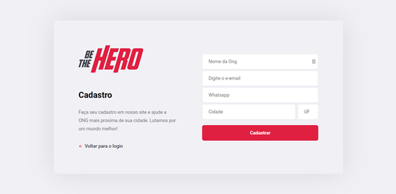
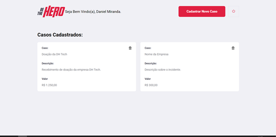
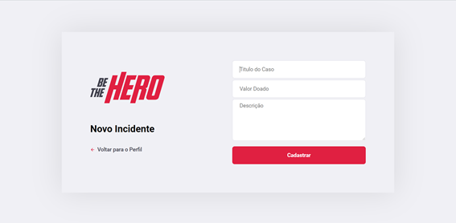

## FrontEnd

* [X] checked   # [checkbox:checked]

> ## FrontEnd
> **Página de Login**
> 
> Endereço: http://seudominio:3000/
> 
> 
> 
> **Página de Registrar**
> 
> Endereço: https://seudomnio:3000/register
> 

> 
> 
> **Página do Perfil do Usuário**
> 
> Endereço: https://seudomnio:3000/profile
> 

> 
> 
> **Novo Incidente**
> 
> Endereço: https://seudomnio:3000/incidents/new
>

## BackEnd
> * [X] **Rota: Login da Ong**
>
> Método: post
>
> Endereço: http://seudominio:3333/session
>
> Controller: SessionController
> 
> **_#Todas as rotas abaixo precisam de uma sessão no localStorage armazenando os campos: ongID, ongName_**
> * [X] **Rota: Cadastro de Ong**
>
> Método: post
>
> Endereço: http://seudominio:3333/ongs
>
> Controller: OngController
> 
> * [X] **Rota: Consulta todas ONG's cadastradas**
>
> Método: get
>
> Endereço: http://seudominio:3333/ongs
>
> Controller: OngController
>  
> * [X] **Rota: Cadastra um Incidente**
>
> Método: post
>
> Endereço: http://seudominio:3333/incidents
>
> Controller: IncidentController
> 
> * [X] **Rota: Visualiza todos os Incidentes Cadastrados**
>
> Método: get
>
> Endereço: http://seudominio:3333/incidents
>
> Controller: IncidentController
> 
> * [X] **Rota: Deleta um incidente**
>
> Método: delete
>
> Endereço: http://seudominio:3333/incidents
>
> Controller: IncidentController
> 
> * [X] **Rota: Visualizar os dados de uma ONG**
>
> Método: get
>
> Endereço: http://seudominio:3333/profile
>
> Controller: ProfileController