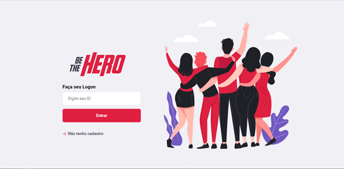

## FrontEnd

* [X] checked   # [checkbox:checked]

## BackEnd

## BackEnd
> * [X] **Rota: Login da Ong**

> Método: post

> Endereço: http://seudominio:3333/session

> Controller: SessionController
> 
> **_#Todas as rotas abaixo precisam seu uma sessão no localStorage_**
> * [X] **Rota: Cadastro de Ong**

> Método: post

> Endereço: http://seudominio:3333/ongs

> Controller: OngController
> 
> * [X] **Rota: Consulta todas ONG's cadastradas**

> Método: get

> Endereço: http://seudominio:3333/ongs

> Controller: OngController
>  
> * [X] **Rota: Cadastra um Incidente**

> Método: post

> Endereço: http://seudominio:3333/incidents

> Controller: IncidentController
> 
> * [X] **Rota: Visualiza todos os Incidentes Cadastrados**

> Método: get

> Endereço: http://seudominio:3333/incidents

> Controller: IncidentController
> 
> * [X] **Rota: Deleta um incidente**

> Método: delete

> Endereço: http://seudominio:3333/incidents

> Controller: IncidentController
> 
> //Perfil da Ong
> * [X] **Rota: Visualizar os dados de uma ONG**

> Método: get

> Endereço: http://seudominio:3333/profile

> Controller: ProfileController;